# Hangman

The Hangman game is a simple game of guessing words. In this game, players guess letters in an unknown word to find out what it means. The player is hanged (and loses) if he guesses too many letters that do not appear in the word.

The live lik can be found here - [Hangman](https://hangmanp3.herokuapp.com/)

---
##  Table of content
- [How to play](#how-to-play)
- [Features](#features)
- [Google Highscore](#highscore-google-sheet)
- [Testing](#testing)
- [Deployment](#deployment)
- [Frameworks, Libraries & Program used](#frameworks-libraries--programs-used)
- [Credits & Acknowledgements](#credits)

---
## How to play
Various PC game titles will be randomly selected, and you must guess them correctly before you run out of lives. There are six attempts you have to make in order to survive.

In case of death, you get plus ten extra attempts

---
## Flow chart

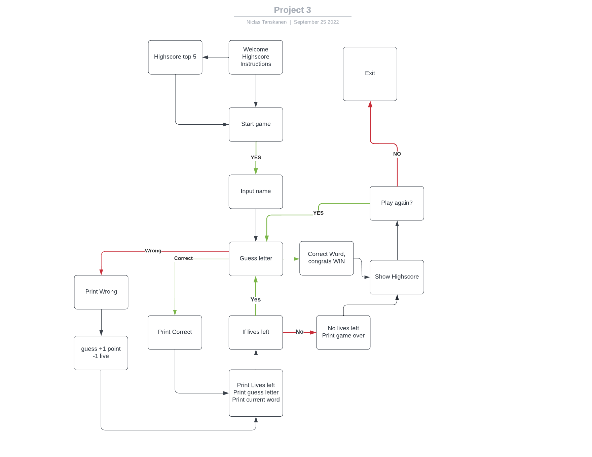

---
## Features
---
### Start menu
As soon as the game starts, you are given instructions on how it works. Upon starting the game, the player has the option to watch the high scores or start playing.

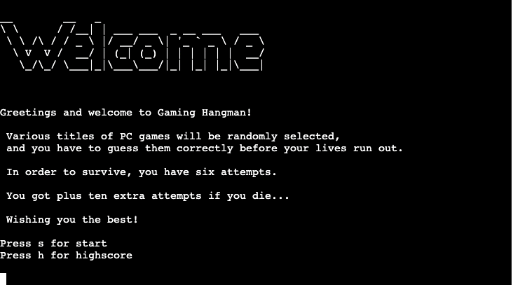

---
### Highscore
 The start menu option highscore shows the five best based on the data in the google sheet. Once you enter your name, you can begin playing.

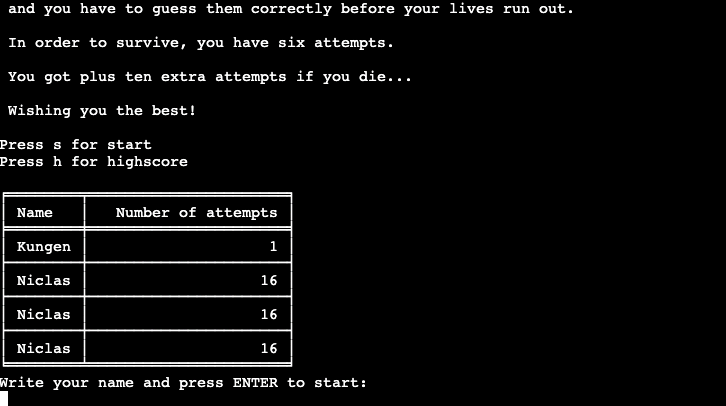

---
### Error username
If you do not enter a name, you will get an error until you have entered your name.

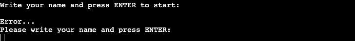

---
### Starting game
After choosing a name, the game starts. You get direct information about how many lives you have and number of attempts. You also get to see the word that the computer has selected.

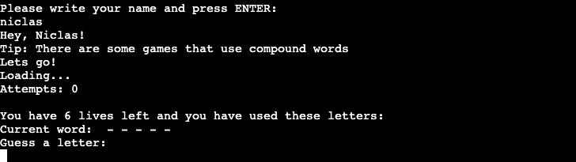

---
### Guess letter correct
If you guess the correct letter, it is immediately visible on "Current word" and also that you have used that letter

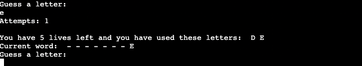

---
### Guess letter wrong
If you guess the wrong letter, you will be informed that the letter is not in the word. It subtracts 1 attempt and 1 life. You also get to see which letter you have guessed.

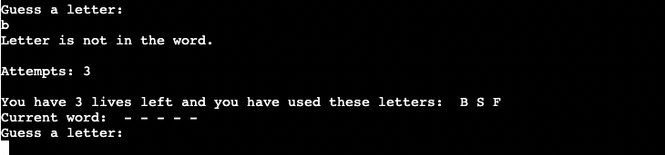

---
### End game highscore
When you have either won or lost, the correct word will be displayed. Number of attempts. Then there is a 5 second delay in showing the highscore so that the data has time to be sent to the google sheet and update the highscore

 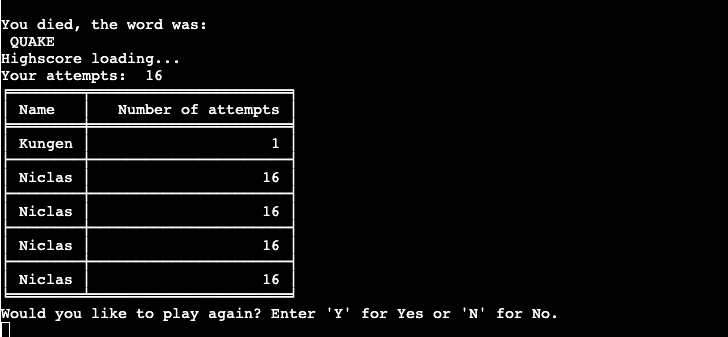

---
### Play again/End game
After the highscore has been updated and displayed, the player has the option to continue playing, or quit. If the player continues to play, the attempts and lives are reset to zero. The name remains. If the player chooses to quit, the program ends.

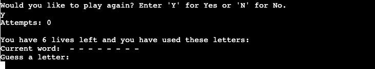

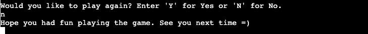

---
### Other
Global variables.

3 variables: 
- ATTEMPTS - to store attempts 
- USER_NAME - to store the chosen nickname in 
- LIVES - store lives

---
### Highscore Google Sheet

Highscore is automatically sent from the game via API and also sends the data back to the game.

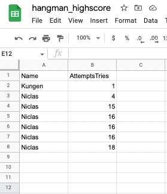

- Google Apps Script to update the highscore automatically in order with lowest attempts at the top.

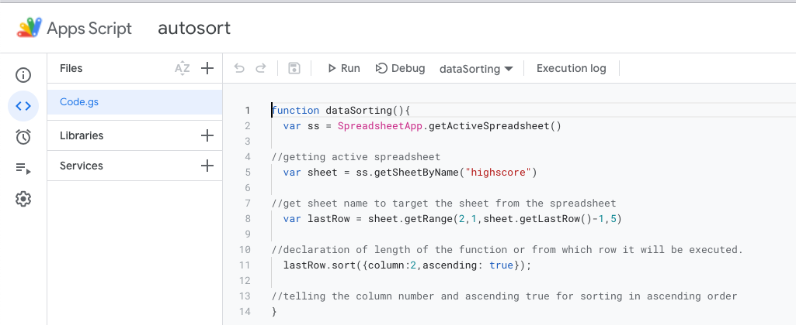

- Two triggers affect the data if you write directly into the google sheet or if the game sends it in. "On change" and "On edit"

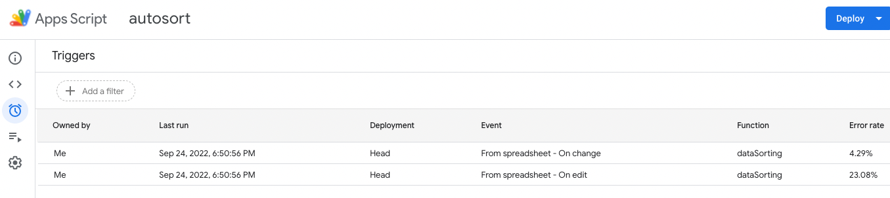

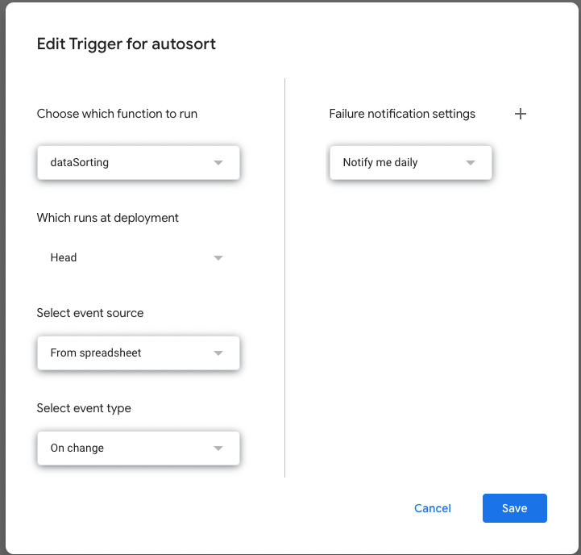

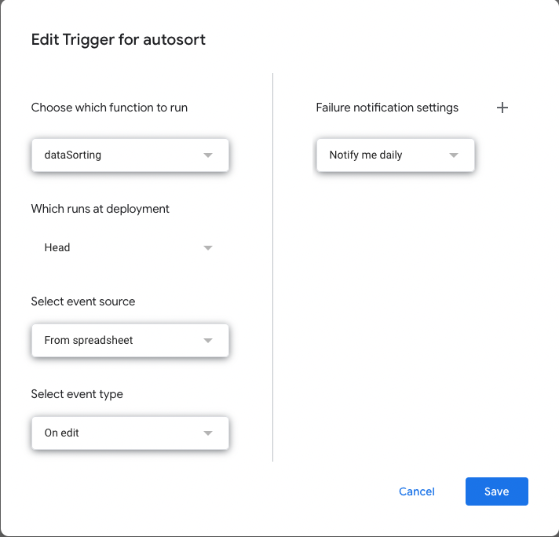

---
## Testing 
### Manual testing
- The device was tested in the Heroku mock terminal from code institute.
- Different people were asked to test it and report bugs.  
- Invalid input was tested in the different input boxes.  
- No errors in de pep8online.com validator. 

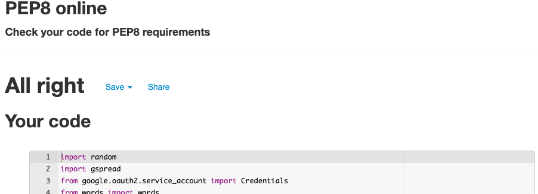

### Fixed bugs 
- Bug with highscore. You didn't have to enter a name to be able to play. Made the highscore not correct. It turned out to be a missing statement in user_input while loop. Fixed.

### Unfixed bugs
N/A

## Deployment 
This site was deployed with the code institute mock terminal for Heroku. 

Deploying a page is as follows:
- The first step is to go to Heroku dashboard and click on new, create a new app.
- Set the build packs to python and jsnode.
- In the deploy tab connect the github repository and click on enable automatic/manual deploy

The link can be found here: https://hangmanp3.herokuapp.com/

## Frameworks, Libraries & Programs Used
- [GitPod](https://gitpod.io/) - Gitpod was used as development environment 
- [GitHub](https://github.com/) - Github was used to deploy the site and store it
- [Google Apps Script](https://www.google.com/script/start/) - Google Apps Script to automatically update highscore
- random - for generating random words
- gspred - To send data to goolge sheet to highscore
- googleoauth2.service_account - To send data to google sheet through API for highscore
- words - Importing words.py for computer choose random words
- pyfiglet - ASCII Art Welcome Text
- getkey - User keypress handling
- tabulate - Create highscore layout
- time - Wating times for functions 
- string - Split string into words using str
- os - To exit() program

## Credits
### code
- ASCII Art Text Banner - https://www.devdungeon.com/content/create-ascii-art-text-banners-python
- Highscore layout - https://www.statology.org/create-table-in-python/ 
- Google Apps Scirpt - https://www.google.com/script/start/

# ACKNOWLEDGEMENTS

- Mitko - It has been a privilege to have Mitko as my mentor at the Code Institute! Thanks for your support and for challenging me!
- Philip Jambrisak - Student at Code Institute. Your support and help are greatly appreciated!
- Callum Dennis - Student at Code Institute. In the midst of blindness and tiredness, he looked at the while loop and gave hints as to where the problem lay. Thank you!

